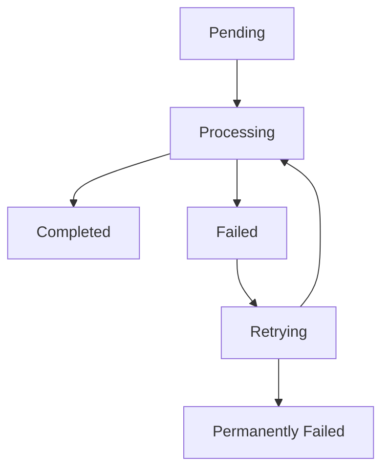

# Job Monitoring

Das Job Monitoring ermöglicht es dir, einzelne Jobs detailliert zu verfolgen, zu analysieren und zu debuggen. Diese Anleitung zeigt dir alle Aspekte der Job-Überwachung im Laravel Queue Manager.

## 🎯 Übersicht

Job Monitoring umfasst:

1. **Job-Tracking** - Einzelne Jobs verfolgen und überwachen
2. **Performance-Analyse** - Ausführungszeiten und Ressourcenverbrauch
3. **Fehler-Debugging** - Fehlgeschlagene Jobs analysieren
4. **Batch-Monitoring** - Job-Batches überwachen
5. **Historische Analyse** - Langzeit-Trends und Muster
6. **Real-time Alerts** - Sofortige Benachrichtigungen bei Problemen

## 📊 Job-Dashboard

### Job-Übersicht aufrufen

Navigiere zum Job-Monitoring:
- **URL**: `/queue-manager/jobs`
- **Navigation**: Sidebar → "📊 Jobs"

### Job-Tabelle verstehen

Die Job-Übersicht zeigt:

| Spalte | Beschreibung | Beispiel |
|--------|--------------|----------|
| **ID** | Eindeutige Job-Identifikation | `job_12345` |
| **Typ** | Job-Klasse | `App\Jobs\SendEmail` |
| **Queue** | Zugewiesene Queue | `emails` |
| **Status** | Aktueller Status | `pending`, `processing`, `completed`, `failed` |
| **Erstellt** | Erstellungszeitpunkt | `2024-01-01 10:00:00` |
| **Gestartet** | Verarbeitungsbeginn | `2024-01-01 10:01:00` |
| **Abgeschlossen** | Verarbeitungsende | `2024-01-01 10:01:30` |
| **Dauer** | Ausführungszeit | `30s` |
| **Versuche** | Anzahl Versuche | `1/3` |
| **Worker** | Verarbeitender Worker | `Worker-1` |
| **Aktionen** | Verfügbare Operationen | Details, Wiederholen, Löschen |

## 🔍 Job-Details anzeigen

### Detailansicht öffnen

1. **Job auswählen**
   - Klicke auf eine Job-ID in der Tabelle
   - Oder verwende "Details" im Aktionen-Menü

2. **Informationen verfügbar**
   - **Basis-Informationen**: ID, Typ, Queue, Status
   - **Zeitstempel**: Erstellt, Gestartet, Abgeschlossen
   - **Performance**: Ausführungszeit, Memory-Verbrauch
   - **Payload**: Job-Parameter und Daten
   - **Logs**: Ausführungs-Logs und Fehler
   - **Worker-Info**: Verarbeitender Worker

### Job-Payload analysieren

```json
{
  "uuid": "12345678-1234-1234-1234-123456789012",
  "displayName": "App\\Jobs\\SendEmail",
  "job": "Illuminate\\Queue\\CallQueuedHandler@call",
  "maxTries": 3,
  "maxExceptions": null,
  "failOnTimeout": false,
  "backoff": [30, 60, 120],
  "timeout": 60,
  "retryUntil": null,
  "data": {
    "commandName": "App\\Jobs\\SendEmail",
    "command": "O:17:\"App\\Jobs\\SendEmail\":3:{s:4:\"user\";O:8:\"App\\User\":1:{s:2:\"id\";i:123;}s:7:\"subject\";s:13:\"Welcome Email\";s:4:\"body\";s:25:\"Welcome to our platform!\"}"
  }
}
```

## 📈 Job-Status verstehen

### Status-Übersicht

#### Pending (Wartend)
- **Beschreibung**: Job wartet auf Verarbeitung
- **Farbe**: Gelb
- **Aktionen**: Priorität ändern, Löschen
- **Typische Dauer**: Sekunden bis Minuten

#### Processing (Verarbeitung)
- **Beschreibung**: Job wird aktuell verarbeitet
- **Farbe**: Blau
- **Aktionen**: Überwachen, Abbrechen (falls möglich)
- **Typische Dauer**: Je nach Job-Typ

#### Completed (Abgeschlossen)
- **Beschreibung**: Job erfolgreich abgeschlossen
- **Farbe**: Grün
- **Aktionen**: Details anzeigen, Archivieren
- **Aufbewahrung**: Konfigurierbar (Standard: 24h)

#### Failed (Fehlgeschlagen)
- **Beschreibung**: Job ist fehlgeschlagen
- **Farbe**: Rot
- **Aktionen**: Wiederholen, Debuggen, Löschen
- **Aufbewahrung**: Bis manuell gelöscht

#### Retrying (Wiederholung)
- **Beschreibung**: Job wird nach Fehler wiederholt
- **Farbe**: Orange
- **Aktionen**: Überwachen, Abbrechen
- **Backoff**: Konfigurierbare Wartezeiten

### Status-Übergänge



## 🔧 Job-Operationen

### Job wiederholen

#### Einzelnen Job wiederholen

```bash
# Über CLI
php artisan queue:retry 12345

# Über Dashboard
# Jobs → Fehlgeschlagene Jobs → Aktionen → "Wiederholen"
```

#### Mehrere Jobs wiederholen

```bash
# Alle fehlgeschlagenen Jobs
php artisan queue:retry all

# Jobs einer bestimmten Queue
php artisan queue:retry --queue=emails

# Jobs nach Zeitraum
php artisan queue:retry --range=1-10
```

#### Programmatisch wiederholen

```php
use Illuminate\Support\Facades\Queue;

// Einzelnen Job wiederholen
Queue::retry('12345');

// Mehrere Jobs wiederholen
$failedJobs = DB::table('failed_jobs')
    ->where('queue', 'emails')
    ->pluck('uuid');

foreach ($failedJobs as $jobId) {
    Queue::retry($jobId);
}
```

### Job abbrechen

#### Laufenden Job abbrechen

```bash
# Job-Prozess finden
ps aux | grep "queue:work"

# Prozess beenden (vorsichtig!)
kill -TERM <process_id>

# Graceful Shutdown
php artisan queue:restart
```

#### Job aus Queue entfernen

```php
// Wartenden Job löschen
DB::table('jobs')->where('id', 12345)->delete();

// Fehlgeschlagenen Job löschen
php artisan queue:forget 12345
```

### Job-Priorität ändern

```php
// Job-Priorität in Datenbank ändern
DB::table('jobs')
    ->where('id', 12345)
    ->update(['priority' => 10]); // Höhere Priorität

// Neuen Job mit hoher Priorität dispatchen
SendEmail::dispatch($user)->onQueue('high-priority');
```

## 📊 Performance-Monitoring

### Ausführungszeiten analysieren

#### Dashboard-Metriken
- **Durchschnittliche Ausführungszeit**: Über alle Jobs
- **Median-Ausführungszeit**: 50. Perzentil
- **95. Perzentil**: Langsamste 5% der Jobs
- **Längste Ausführungszeit**: Maximum in Zeitraum

#### Performance-Queries

```php
// Durchschnittliche Ausführungszeit pro Job-Typ
DB::table('job_batches')
    ->select('name', DB::raw('AVG(TIMESTAMPDIFF(SECOND, created_at, finished_at)) as avg_duration'))
    ->whereNotNull('finished_at')
    ->groupBy('name')
    ->orderBy('avg_duration', 'desc')
    ->get();

// Langsamste Jobs der letzten 24h
DB::table('jobs_history')
    ->select('*', DB::raw('TIMESTAMPDIFF(SECOND, started_at, completed_at) as duration'))
    ->where('created_at', '>=', now()->subDay())
    ->orderBy('duration', 'desc')
    ->limit(10)
    ->get();
```

### Memory-Verbrauch überwachen

#### Memory-Tracking aktivieren

```php
// config/queue-manager.php
'monitoring' => [
    'track_memory' => true,
    'memory_threshold' => 100, // MB
    'alert_on_high_memory' => true,
],
```

#### Memory-Analyse

```php
// Jobs mit hohem Memory-Verbrauch
DB::table('job_metrics')
    ->select('job_type', 'max_memory_mb', 'avg_memory_mb')
    ->where('max_memory_mb', '>', 100)
    ->orderBy('max_memory_mb', 'desc')
    ->get();
```

### Throughput-Analyse

#### Jobs pro Zeitraum

```php
// Jobs pro Stunde (letzte 24h)
DB::table('jobs_history')
    ->select(
        DB::raw('HOUR(completed_at) as hour'),
        DB::raw('COUNT(*) as job_count')
    )
    ->where('completed_at', '>=', now()->subDay())
    ->groupBy('hour')
    ->orderBy('hour')
    ->get();

// Jobs pro Queue (letzte Woche)
DB::table('jobs_history')
    ->select('queue', DB::raw('COUNT(*) as total_jobs'))
    ->where('completed_at', '>=', now()->subWeek())
    ->groupBy('queue')
    ->orderBy('total_jobs', 'desc')
    ->get();
```

## 🚨 Fehler-Debugging

### Fehlgeschlagene Jobs analysieren

#### Fehler-Dashboard

Das Fehler-Dashboard zeigt:
- **Fehlerrate**: Prozentsatz fehlgeschlagener Jobs
- **Häufigste Fehler**: Top-Fehlermeldungen
- **Fehler-Trends**: Zeitliche Entwicklung
- **Betroffene Queues**: Queues mit den meisten Fehlern

#### Fehler-Details anzeigen

```bash
# Alle fehlgeschlagenen Jobs anzeigen
php artisan queue:failed

# Spezifischen fehlgeschlagenen Job anzeigen
php artisan queue:failed --id=12345

# Fehler-Logs anzeigen
tail -f storage/logs/laravel.log | grep "queue"
```

### Häufige Fehlertypen

#### Timeout-Fehler

**Ursachen:**
- Job läuft länger als konfiguriertes Timeout
- Externe API-Aufrufe ohne Timeout
- Endlosschleifen im Job-Code

**Lösungen:**
```php
// Timeout erhöhen
class LongRunningJob implements ShouldQueue
{
    public $timeout = 300; // 5 Minuten
    
    public function handle()
    {
        // Lange Verarbeitung...
    }
}

// Externe API-Aufrufe mit Timeout
Http::timeout(30)->get('https://api.example.com');
```

#### Memory-Limit-Fehler

**Ursachen:**
- Große Datenmengen im Memory
- Memory-Leaks in Job-Code
- Zu niedriges Memory-Limit

**Lösungen:**
```php
// Memory-Limit erhöhen
class DataProcessingJob implements ShouldQueue
{
    public $memory = 512; // 512 MB
    
    public function handle()
    {
        // Chunked processing
        User::chunk(1000, function ($users) {
            foreach ($users as $user) {
                // Verarbeitung...
            }
        });
    }
}
```

#### Database-Fehler

**Ursachen:**
- Deadlocks
- Connection-Timeouts
- Constraint-Verletzungen

**Lösungen:**
```php
// Retry-Logik mit Backoff
class DatabaseJob implements ShouldQueue
{
    public $tries = 3;
    public $backoff = [30, 60, 120];
    
    public function handle()
    {
        DB::transaction(function () {
            // Database operations
        });
    }
    
    public function failed(Exception $exception)
    {
        Log::error('Database job failed', [
            'exception' => $exception->getMessage(),
            'job_id' => $this->job->getJobId(),
        ]);
    }
}
```

### Custom Error-Handling

#### Job-spezifische Fehlerbehandlung

```php
class EmailJob implements ShouldQueue
{
    public function handle()
    {
        try {
            // E-Mail senden
            Mail::to($this->user)->send(new WelcomeEmail());
        } catch (Exception $e) {
            // Custom Error-Handling
            $this->handleEmailError($e);
            throw $e; // Re-throw für Queue-System
        }
    }
    
    private function handleEmailError(Exception $e)
    {
        // Fehler-spezifische Logik
        if ($e instanceof MailgunException) {
            // Mailgun-spezifische Behandlung
        } elseif ($e instanceof SMTPException) {
            // SMTP-spezifische Behandlung
        }
        
        // Fehler loggen
        Log::error('Email job failed', [
            'user_id' => $this->user->id,
            'error' => $e->getMessage(),
            'trace' => $e->getTraceAsString(),
        ]);
    }
    
    public function failed(Exception $exception)
    {
        // Job endgültig fehlgeschlagen
        $this->user->notify(new EmailDeliveryFailed($exception));
    }
}
```

## 📦 Batch-Monitoring

### Job-Batches verwalten

#### Batch erstellen und überwachen

```php
use Illuminate\Bus\Batch;
use Illuminate\Support\Facades\Bus;

// Batch erstellen
$batch = Bus::batch([
    new ProcessUser(1),
    new ProcessUser(2),
    new ProcessUser(3),
])->then(function (Batch $batch) {
    // Alle Jobs erfolgreich
    Log::info('Batch completed', ['batch_id' => $batch->id]);
})->catch(function (Batch $batch, Throwable $e) {
    // Mindestens ein Job fehlgeschlagen
    Log::error('Batch failed', [
        'batch_id' => $batch->id,
        'error' => $e->getMessage(),
    ]);
})->finally(function (Batch $batch) {
    // Batch abgeschlossen (erfolgreich oder nicht)
    Log::info('Batch finished', ['batch_id' => $batch->id]);
})->dispatch();

// Batch-Status überwachen
$batch = Bus::findBatch($batchId);
echo "Progress: {$batch->progress()}%";
echo "Pending: {$batch->pendingJobs}";
echo "Failed: {$batch->failedJobs}";
```

#### Batch-Dashboard

Das Batch-Dashboard zeigt:
- **Aktive Batches**: Laufende Job-Batches
- **Fortschritt**: Prozentuale Fertigstellung
- **Erfolgsrate**: Verhältnis erfolgreiche/fehlgeschlagene Jobs
- **Geschätzte Restzeit**: Basierend auf bisheriger Performance

### Batch-Operationen

#### Batch abbrechen

```php
// Batch abbrechen
$batch = Bus::findBatch($batchId);
$batch->cancel();

// Über CLI
php artisan queue:batch:cancel {batch-id}
```

#### Fehlgeschlagene Jobs in Batch wiederholen

```php
// Fehlgeschlagene Jobs wiederholen
$batch = Bus::findBatch($batchId);
$batch->add([
    // Neue Jobs hinzufügen
    new ProcessUser(4),
    new ProcessUser(5),
]);
```

## 📈 Historische Analyse

### Langzeit-Trends

#### Performance-Trends

```php
// Durchschnittliche Ausführungszeit pro Tag (letzte 30 Tage)
DB::table('job_metrics')
    ->select(
        DB::raw('DATE(created_at) as date'),
        DB::raw('AVG(duration_seconds) as avg_duration'),
        DB::raw('COUNT(*) as job_count')
    )
    ->where('created_at', '>=', now()->subDays(30))
    ->groupBy('date')
    ->orderBy('date')
    ->get();
```

#### Fehler-Trends

```php
// Fehlerrate pro Woche
DB::table('jobs_history')
    ->select(
        DB::raw('YEARWEEK(created_at) as week'),
        DB::raw('COUNT(*) as total_jobs'),
        DB::raw('SUM(CASE WHEN status = "failed" THEN 1 ELSE 0 END) as failed_jobs'),
        DB::raw('(SUM(CASE WHEN status = "failed" THEN 1 ELSE 0 END) / COUNT(*)) * 100 as failure_rate')
    )
    ->where('created_at', '>=', now()->subWeeks(12))
    ->groupBy('week')
    ->orderBy('week')
    ->get();
```

### Kapazitätsplanung

#### Peak-Zeiten identifizieren

```php
// Jobs pro Stunde über alle Tage
DB::table('jobs_history')
    ->select(
        DB::raw('HOUR(created_at) as hour'),
        DB::raw('AVG(job_count) as avg_jobs_per_hour')
    )
    ->from(
        DB::table('jobs_history')
            ->select(
                DB::raw('HOUR(created_at) as hour'),
                DB::raw('DATE(created_at) as date'),
                DB::raw('COUNT(*) as job_count')
            )
            ->groupBy('hour', 'date')
    )
    ->groupBy('hour')
    ->orderBy('hour')
    ->get();
```

#### Ressourcen-Vorhersage

```php
// Wachstumstrend berechnen
$monthlyGrowth = DB::table('jobs_history')
    ->select(
        DB::raw('YEAR(created_at) as year'),
        DB::raw('MONTH(created_at) as month'),
        DB::raw('COUNT(*) as job_count')
    )
    ->where('created_at', '>=', now()->subMonths(12))
    ->groupBy('year', 'month')
    ->orderBy('year', 'month')
    ->get();

// Lineare Regression für Vorhersage
$trend = calculateLinearTrend($monthlyGrowth);
$predictedJobs = $trend['slope'] * 13 + $trend['intercept']; // Nächster Monat
```

## 🔔 Real-time Alerts

### Alert-Konfiguration

#### Alert-Regeln definieren

```php
// config/queue-manager.php
'alerts' => [
    'job_failure_rate' => [
        'enabled' => true,
        'threshold' => 5, // 5% Fehlerrate
        'window' => 300, // 5 Minuten
        'channels' => ['mail', 'slack'],
    ],
    'job_timeout' => [
        'enabled' => true,
        'threshold' => 600, // 10 Minuten
        'channels' => ['mail'],
    ],
    'queue_backlog' => [
        'enabled' => true,
        'threshold' => 1000, // 1000 wartende Jobs
        'channels' => ['slack'],
    ],
],
```

#### Custom Alert-Handler

```php
// app/Listeners/JobAlertListener.php
class JobAlertListener
{
    public function handle($event)
    {
        switch ($event->type) {
            case 'high_failure_rate':
                $this->handleHighFailureRate($event);
                break;
            case 'job_timeout':
                $this->handleJobTimeout($event);
                break;
            case 'queue_backlog':
                $this->handleQueueBacklog($event);
                break;
        }
    }
    
    private function handleHighFailureRate($event)
    {
        Mail::to('admin@example.com')->send(new HighFailureRateAlert($event));
        
        // Slack-Benachrichtigung
        Http::post('https://hooks.slack.com/services/...', [
            'text' => "🚨 Hohe Fehlerrate in Queue {$event->queue}: {$event->failure_rate}%"
        ]);
    }
}
```

### Monitoring-Dashboard

#### Real-time Metriken

```javascript
// Dashboard Auto-Update (Alpine.js)
function jobMonitoring() {
    return {
        metrics: {},
        
        init() {
            this.updateMetrics();
            setInterval(() => this.updateMetrics(), 5000); // 5 Sekunden
        },
        
        async updateMetrics() {
            const response = await fetch('/queue-manager/api/job-metrics');
            this.metrics = await response.json();
            
            // Alert-Prüfung
            if (this.metrics.failure_rate > 5) {
                this.showAlert('Hohe Fehlerrate: ' + this.metrics.failure_rate + '%');
            }
        },
        
        showAlert(message) {
            // Toast-Benachrichtigung anzeigen
            this.$dispatch('show-toast', { message, type: 'error' });
        }
    }
}
```

## 🛠️ Debugging-Tools

### Job-Tracing

#### Detailliertes Logging aktivieren

```php
// config/queue-manager.php
'debugging' => [
    'enabled' => true,
    'trace_jobs' => true,
    'log_payload' => true,
    'log_performance' => true,
],
```

#### Custom Job-Tracer

```php
// app/Services/JobTracer.php
class JobTracer
{
    public static function trace($job, $event, $data = [])
    {
        Log::info('Job Trace', [
            'job_id' => $job->getJobId(),
            'job_class' => get_class($job),
            'event' => $event,
            'timestamp' => now()->toISOString(),
            'memory_usage' => memory_get_usage(true),
            'peak_memory' => memory_get_peak_usage(true),
            'data' => $data,
        ]);
    }
}

// In Job-Klasse verwenden
class TrackedJob implements ShouldQueue
{
    public function handle()
    {
        JobTracer::trace($this, 'started');
        
        // Job-Logik...
        
        JobTracer::trace($this, 'completed', ['processed_items' => $count]);
    }
}
```

### Performance-Profiling

#### Job-Profiler

```php
// app/Services/JobProfiler.php
class JobProfiler
{
    private $startTime;
    private $startMemory;
    
    public function start()
    {
        $this->startTime = microtime(true);
        $this->startMemory = memory_get_usage(true);
    }
    
    public function end($job)
    {
        $duration = microtime(true) - $this->startTime;
        $memoryUsed = memory_get_usage(true) - $this->startMemory;
        $peakMemory = memory_get_peak_usage(true);
        
        DB::table('job_performance')->insert([
            'job_id' => $job->getJobId(),
            'job_class' => get_class($job),
            'duration_ms' => $duration * 1000,
            'memory_used_mb' => $memoryUsed / 1024 / 1024,
            'peak_memory_mb' => $peakMemory / 1024 / 1024,
            'created_at' => now(),
        ]);
    }
}
```

## ➡️ Nächste Schritte

Nach dem Job Monitoring solltest du:

- **[Queue Management](Queue-Management.md)** - Queues optimal konfigurieren
- **[Worker Management](Worker-Management.md)** - Worker-Performance optimieren
- **[Häufige Probleme](Häufige-Probleme.md)** - Troubleshooting-Strategien
- **[API Endpoints](API-Endpoints.md)** - Programmatische Integration

## 📚 Weiterführende Ressourcen

- [Laravel Queue Monitoring](https://laravel.com/docs/queues#monitoring)
- [Job Batching Documentation](https://laravel.com/docs/queues#job-batching)
- [Performance Optimization Guide](https://laravel.com/docs/queues#optimizing-performance)